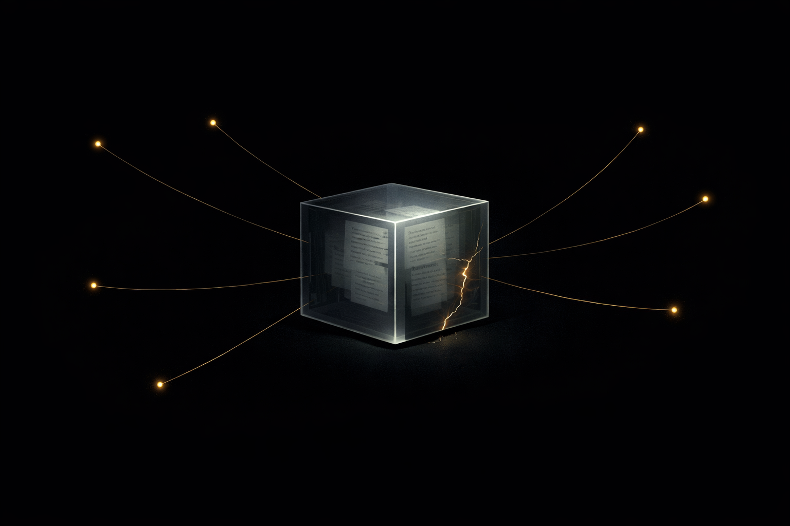

# Lockbox — Twitter Thread

---

**1/**
Built Lockbox in a single session for @synthesis_md — collectively-unlockable encrypted content, deployed across 5 networks.

The idea: what if reading wasn't a solo purchase, but a multiplayer unlock?

N people contribute. Threshold hit. Content decrypts for everyone.

keeeeeeeks.github.io/lockbox

---

**2/**
The speed came from good docs.

Tempo's EVM compatibility page told us exactly what was different (stablecoin gas, no native token, 5x state creation costs). Lit Protocol's ACC docs mapped cleanly to our contract's `isUnlocked()`. ERC-8004's registry was plug-and-play.

When docs are honest about edge cases, you ship faster.

---

**3/**
What we built:

- Solidity contracts (Lockbox + Factory) with threshold unlock + progressive reveals at 25/50/75%
- Lit Protocol threshold encryption — content sealed until on-chain state flips
- MPP integration — HTTP 402 payment flow so agents can pay-per-read on Tempo
- ERC-8004 agent identity + reputation receipts
- Frontend: browse, create, contribute across all networks

---

**4/**
Deployed on:

Base mainnet
Tempo mainnet
Base Sepolia
Status Sepolia
Tempo testnet

One codebase, five chains. The Tempo mainnet deploy was the most interesting — no native gas token, fees in stablecoins. Had to set the account's fee token preference to USDC via viem's Tempo actions before deploying.

---

**5/**
The motivation: content monetization is broken.

Paywalls isolate. Ads corrupt. Free devalues.

Lockbox reframes access as coordination. The progress bar IS the marketing. Social proof is baked into the mechanism. And post-unlock, the content becomes a public good — contributors funded something the world gets.

---

**6/**
For agents:

- Metadata is always free (title, abstract, tags) — semantic search without paying
- `getProgress()` lets agents prioritize lockboxes near threshold
- MPP endpoint returns content via standard HTTP 402
- Each contribution builds on-chain reputation via ERC-8004

Machines need to access knowledge too. This gives them a way.

---

**7/**
Tracks entered: Open, Agents With Receipts (ERC-8004), Let the Agent Cook, Agent Services on Base, Agentic Storage, Status Network, Venice, Agents That Pay, Dark Knowledge Skills

One project. Nine tracks.

---

**8/**
The learning: the hardest part wasn't the crypto, the encryption, or the multi-chain deployment.

It was defining what "complete" means for content that's collectively owned. When does an article belong to its readers? When they fund it? When they unlock it? When they share it?

We don't have the answer. But we built the primitive.

github.com/Keeeeeeeks/lockbox
